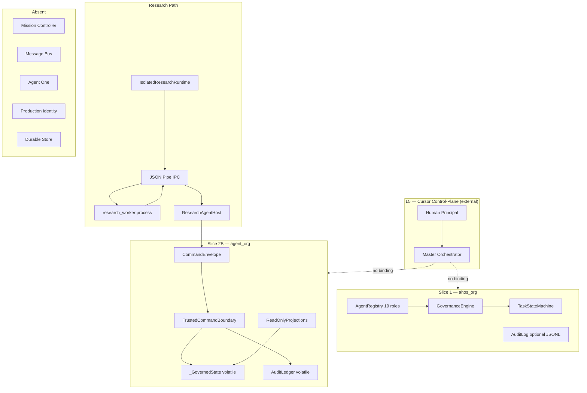

# Agent-14 — Agent Runtime Architecture

```text
DOCUMENT_ID      = AGENT_14_AGENT_RUNTIME_ARCHITECTURE
MISSION_ID       = TASK-20260914-015
AGENT_ID         = AGENT-14
DIRECT_COMMANDER = MASTER ORCHESTRATOR
VERSION          = 0.1.0
STATUS           = DESIGN_ONLY / READ_ONLY_ARCHITECTURE_MISSION
AUTHORITY        = NONE CREATED
RUNTIME_EFFECT   = NONE
AHOS_EFFECT      = NONE
CODE_CHANGES     = NONE
```

This document is a **read-only architecture artifact** produced by AGENT-14 under explicit activation for TASK-20260914-015. It does not implement runtime, modify AHOS, grant authority, resolve Dual-19, create Agent One, or claim inter-agent communication occurred.

Facts cite repository evidence with explicit classification labels. Recommendations are labeled `[PROPOSED]`.

---

## 1. Executive Verdict

### 1.1 The question answered

**What is the smallest production-credible runtime that allows the organization to actually operate as an organization?**

Not 19 AI agents. Not a message broker farm. Not Kubernetes.

The minimum trustworthy organizational runtime is a **local, Windows-first, durable control-plane service** comprising six cooperating components:

| # | Component | Why it is mandatory |
|---|-----------|---------------------|
| 1 | **Mission Controller** (durable) | Without mission identity, scope, lifecycle, and terminalization, agents cannot be safely activated, bounded, or recovered. |
| 2 | **Agent Lifecycle Controller** (bound to Mission Controller) | Without enforced REGISTERED→IDLE→ACTIVATION_REQUESTED→AUTHORIZED→ACTIVE→terminal→IDLE, self-activation and zombie missions are inevitable. |
| 3 | **Cursor Federation Bridge** | Without binding L5 chat missions to runtime mission/task records, the organization remains artifact-mediated fiction. |
| 4 | **Durable TCB Store (Slice 2C evolution)** | Without durable governed state, restart destroys missions, audit, grants, and epistemic artifacts. |
| 5 | **Orchestrator-Mediated Message Bus** (SQLite WAL, local) | Without authenticated, durable, auditable delivery, agents cannot collaborate without human shuttle. |
| 6 | **Local Identity + Authorization Service** | Without replacing `LocalOperatorSessionStub`, every activation is a trust-me string. |

Everything else — domain intelligence (07–13), Agent One, performance memory, distributed deployment — is **downstream** of this substrate.

### 1.2 Honest current state

```text
DOCUMENTED AGENTS + ARCHITECTURE + TCB + RESEARCH WORKER + CURSOR MO
≠
OPERATIONAL MULTI-AGENT ORGANIZATION
```

`[VERIFIED]` 251 tests pass (`python run_all_tests.py`, executed 2026-09-14, ~28.6s). The repo has a **working policy/epistemic core** and **one process-isolated research worker**. It does **not** have mission control, message delivery, durable state, specialist processes, or Cursor-to-runtime binding.

### 1.3 Architectural north star

Design a **Controlled Multi-Agent Organizational Operating System**, not a generic AI agent framework.

Preserve:

```text
COMMAND ≠ KNOWLEDGE
KNOWLEDGE ≠ AUTHORITY
EVIDENCE ≠ TRUTH
TRUTH ≠ DECISION
DECISION ≠ EXECUTION
EXECUTION ≠ GOVERNANCE
```

And:

```text
DOCUMENTED ≠ SENT ≠ RECEIVED ≠ UNDERSTOOD ≠ IMPLEMENTED ≠ VERIFIED ≠ ACCEPTED
```

---

## 2. Repository Forensics

### 2.1 Project boundaries verified

| Project | Path | Role | Modified this mission |
|---------|------|------|----------------------|
| **Agent Organization** | `G:\robat\ahos-agent-org` | Control-plane workspace | NO |
| **AHOS (product)** | `G:\robat\ahos` | Evidence-first crypto intelligence platform | NO (read-only reference) |

`[VERIFIED]` Zero cross-repo references exist. AHOS has 25 product agents (`AG-01`…`AG-25`); org has separate registries. AHOS `orchestrated=0/25`; AG-01 missing by design. Org must not assume AHOS runtime capabilities.

### 2.2 Mission references

| Reference | Status | Evidence |
|-----------|--------|----------|
| Mission 5 | `[NOT FOUND]` as explicit mission ID | No `TASK-*` or `MISSION_5` artifact |
| Mission 5.5 | `[NOT FOUND]` as explicit mission ID | Section 5.5 in Agent-08 doc is unrelated (Transformations) |
| Mission 5.6 | `[IMPLEMENTED]` | `agent_org/research_host/analyst_commit.py`; Strategy A preflight + sequential TCB writes; tests in `tests2b/test_research_analyst_agent.py` |

### 2.3 Test evidence

```text
Ran 251 tests in 28.573s — OK
  Slice 1 (tests/):   48
  Slice 2B (tests2b/): 203
```

Master Orchestrator doc claim of 49 Slice 1 tests is `[STALE]`; actual count is 48.

---

## 3. Current Runtime Inventory

### 3.1 Three implemented control planes (do not invent a fourth)

```text
┌─────────────────────────────────────────────────────────────────┐
│  CURSOR CONTROL-PLANE (L5) — external, not in repo              │
│  Human Principal → Master Orchestrator → Cursor workers         │
└───────────────────────────┬─────────────────────────────────────┘
                            │ NO RUNTIME BINDING
        ┌───────────────────┼───────────────────┐
        ▼                   ▼                   ▼
┌───────────────┐   ┌───────────────┐   ┌───────────────────────┐
│ Slice 1       │   │ Slice 2B      │   │ Research Path         │
│ ahos_org/     │   │ agent_org/    │   │ research_worker/      │
│ [IMPLEMENTED] │   │ [IMPLEMENTED] │   │ + research_host/      │
│ in-process    │   │ in-memory TCB │   │ [IMPLEMENTED]         │
│ 19 logical    │   │ epistemic     │   │ spawn + JSON IPC      │
│ roles         │   │ core          │   │ 1 Class A analyst     │
└───────────────┘   └───────────────┘   └───────────────────────┘
```

### 3.2 Classification matrix

| Component | Class | Durability | Process model |
|-----------|-------|------------|---------------|
| Slice 1 registry/tasks/governance | `[IMPLEMENTED]` | In-memory; audit optional JSONL | Same process |
| Slice 2B TCB/epistemic store | `[IMPLEMENTED]` | In-memory only | Same process |
| Research worker | `[IMPLEMENTED]` | Ephemeral worker process | Windows `spawn` |
| Communication protocol | `[DOCUMENTED_ONLY]` | N/A | N/A |
| Mission controller | `[NOT IMPLEMENTED]` | N/A | N/A |
| Message bus | `[NOT IMPLEMENTED]` | N/A | N/A |
| Agent One | `[NOT IMPLEMENTED]` | N/A | N/A |
| 19 Plane D specialists | `[PLANNED]` | N/A | N/A |
| Constitution L2 enforcement | `[DOCUMENTED_ONLY]` | N/A | N/A |
| Operating Baseline v1 runtime | `[DOCUMENTED_ONLY]` | N/A | N/A |

---

## 4. Existing Capability Matrix

| Capability | Slice 1 | Slice 2B | Research | Docs | Runtime gap |
|------------|---------|----------|----------|------|-------------|
| Agent registry (19 logical) | YES | partial (`REGISTER_AGENT`) | RESEARCH_ANALYST only | Plane D blueprint | No federation |
| Task FSM | YES | YES (`GovernedTask`) | mission scope only | — | Not bound to agent lifecycle |
| Fail-closed authz | YES | YES (TCB + grants) | IPC allow/deny | protocols | Cursor unbound |
| Epistemic artifacts | — | YES (12+ types) | host commit only | Agent-05 arch | No chat→TCB bridge |
| Command ingress | — | YES (`CommandEnvelope`) | via host | comm protocol | Different envelope |
| Process isolation | — | — | YES (not OS sandbox) | — | Not generalized |
| Audit hash chain | optional JSONL | in-memory | in-memory host | — | Not durable/anchored |
| Verification gates | symbolic | YES (D-01/D-04) | DENIED to worker | Agent-16/19 roles | No verifier dispatch |
| Knowledge promotion | — | YES (gated) | DENIED | — | No domain adapters |
| AHOS connect | DENIED | DENIED | DENIED | — | Mediated ingest TBD |
| Inter-agent messaging | — | — | host↔worker only | envelope spec | **Critical gap** |
| Mission identity | task IDs exist | task IDs exist | per research task | — | No mission controller |
| Context sync | — | — | READ_CONTEXT snapshot | update protocol | No version gate |
| Change propagation | — | — | — | update protocol | Not implemented |

---

## 5. Current-State Architecture



**Authority-collapse risk today:** Cursor chat can *appear* to activate agents, issue missions, and collect results with no runtime enforcement. Slice 1/2B enforce policy only when code paths are explicitly invoked — not when a Cursor session runs.

---

## 6. Target Organizational Runtime

```text
Human Principal (Mehrdad)
        ↓
Master Orchestrator / future Agent One (coordination ONLY)
        ↓
Mission Controller (durable owner of mission state)
        ↓
Agent Registry / Identity Service (federated planes A/B/C/D)
        ↓
Command Tree (authority downward)
        ↓
Specialist Agent Runtimes (process-isolated)
        ↕
Knowledge Mesh (policy-governed lateral exchange — NOT command)
        ↓
Independent Verification Plane
        ↓
Acceptance (human / governance boundary)
        ↓
Canonical Organizational Memory (versioned, durable)
```

Each arrow is a **separate trust concern**. Components that must not collapse:

- Commander ≠ Supervisor ≠ Verifier ≠ Knowledge Owner ≠ Executor

---

## 7. Trust Boundaries

| Trust Domain | Owner | Must NOT also own | Initial deployment |
|--------------|-------|-------------------|-------------------|
| **Human Principal** | Mehrdad | Routine evidence extraction | External |
| **Orchestrator** | MO / future Agent One | TCB mutation, verification, acceptance | Cursor → local service |
| **Mission Controller** | New runtime service | Epistemic promotion, domain logic | Local process + SQLite |
| **Lifecycle Controller** | Subordinate to Mission Controller | Authorization grants | Same process as MC initially |
| **Authorization** | TCB + grant store | Mission creation, message routing | TCB process |
| **TCB / Governed State** | Slice 2C service | Specialist execution | Separate process (Phase 1+) |
| **Specialist Workers** | Per-agent process | TCB direct access, cross-agent command | Spawn/container |
| **Message Bus** | Mediated delivery service | Authorization decisions | SQLite queue |
| **Verification Plane** | Independent principals | Execution, promotion | Separate verifier sessions |
| **Acceptance** | Human / governance record | Verification execution | Human + audit |
| **Canonical Memory** | TCB projections + version store | Live mission execution | Durable store |

**Initial co-location (safe):** Mission Controller + Lifecycle + Federation Bridge + Message Bus in one local Python service with SQLite — **provided** TCB mutation ingress is a separate process boundary by Phase 1 end.

**Must separate early:** TCB mutation ingress from specialist workers (proven by research path).

---

## 8. Command Tree

### 8.1 Current authority (do not invent)

```text
MEHRDAD (Human Principal)
   ↓  explicit L5 mission / L2 governance decision
MASTER ORCHESTRATOR (Cursor role — coordination, NO runtime authority)
   ↓  explicit activation per mission (chat today; runtime record tomorrow)
SPECIALIST AGENT (Cursor worker or future process — executor ONLY within charter)
```

`[VERIFIED]` No Domain Commanders exist in runtime. Plane A `agent.chief-orchestrator` is a **logical Slice 1 role** with inspect/plan/propose tokens only — **not** Agent One, **not** Master Orchestrator.

### 8.2 Future target (gated)

```text
MEHRDAD
   ↓
AGENT ONE / MASTER ORCHESTRATOR (coordination — FUTURE_NON_AUTHORITY_ROOT)
   ↓
DOMAIN COMMANDERS (NOT IMPLEMENTED — requires charters + runtime)
   ↓
SPECIALIST AGENTS
```

### 8.3 Role separation matrix

| Role | Parent | Direct Commander | Command Scope | Activation Authority | Delegation | Verification | Acceptance | Escalation |
|------|--------|------------------|---------------|---------------------|------------|--------------|------------|------------|
| Human Principal | — | — | All governance | All (L2) | To MO/Agent One | Final | Final | — |
| Master Orchestrator | Human | Human | Mission formalization | **NONE** (requests MC) | **NONE** | **NONE** | **NONE** | To Human |
| Agent One (future) | Human | Human | Intent→mission mapping | **Via MC only** | Attenuated via MC | **NONE** | **NONE** | To Human |
| Mission Controller | Human/Orchestrator | Human | Mission lifecycle | Authorized activations | Task decomposition only | Dispatch only | **NONE** | To Human |
| Domain Commander | Orchestrator | Orchestrator | Domain missions | Sub-agents in domain | Within domain grant | **NONE** | **NONE** | To Orchestrator |
| Specialist Agent | Commander | Direct commander | Task execution | **NONE** | **NONE** unless granted | **NONE** (self) | **NONE** | To commander |
| Verifier (16/19) | Independent | Mission Controller | Verification tasks | **NONE** | **NONE** | Own work only | **NONE** | To Human |
| Supervisor | Separate service | Human/MC | Observation | **NONE** | **NONE** | **NONE** | **NONE** | To Human |

**Recommendation `[PROPOSED]`:** Commander, Supervisor, Verifier, Knowledge Owner, and Executor should be **separate roles**. Initially, Supervisor can be audit-query-only; Verifier must be a different principal from builder.

---

## 9. Knowledge Mesh

### 9.1 Principle

```text
COMMAND TREE:     authority flows DOWN only
KNOWLEDGE MESH:   evidence/knowledge flows LATERALLY under policy
```

Knowledge exchange must NOT imply authority, command rights, verification rights, or promotion rights.

### 9.2 Allowed lateral patterns

| Pattern | Flow | Authority implication |
|---------|------|----------------------|
| Discovery Record | Agent-12 → MC → impact analysis → mission for Agent-07 | NONE — MC creates mission |
| Evidence Request | Agent A → MC → routed request → Agent B | NONE — response is candidate evidence |
| Contradiction Report | Any → MC → Agent-05 path + open ContradictionCase | NONE until TCB |
| Dependency Notification | Agent → MC → affected agents notified | NONE — informational |
| Capability Gap | Agent → MC → Human/Orchestrator | NONE |

### 9.3 Forbidden lateral patterns

- Agent-12 directly activating Agent-07
- Agent-12 sending `TASK_REQUEST` that Agent-07 treats as command
- Sharing grants/credentials via mesh
- Promotion requests via mesh (must be `CommandEnvelope` → TCB)
- Verification requests where verifier = builder

### 9.4 Mesh implementation `[PROPOSED]`

Phase 3: SQLite-backed **Knowledge Exchange Service** subordinate to Mission Controller:

- Accepts only `MESSAGE_TYPE`s that are NOT command-equivalent
- Every message requires `mission_id`, `correlation_id`, `sender_agent_id`, `capability_context`
- Delivery is **mediated** — no direct agent-to-agent socket without MC registration
- All mesh messages are **L3/L5 documentary** until ingested as TCB artifacts via separate adapter

---

## 10. Mission Controller

### 10.1 Verdict: **YES — mandatory dedicated component**

Without it: duplicate execution, zombie missions, stale commands, cross-mission contamination, and unbounded retries are un preventable.

### 10.2 Ownership

**Mission Controller owns Mission State.** It is the single writer for mission records. Specialists read projections; Orchestrator creates via MC API; TCB receives mission-scoped commands only when MC authorizes.

### 10.3 Entity relationships

```text
Mission (mission_id)
  ├── parent_mission_id (optional)
  ├── task_id root
  ├── human_command_ref (L5/L2 binding)
  ├── context_snapshot_ref
  ├── policy_version
  ├── status: DRAFT | AUTHORIZED | ACTIVE | SUSPENDED | QUARANTINED | TERMINAL
  └── Tasks[]
        Task (task_id)
          ├── assigned_agent_id
          ├── capability_grant_ref
          ├── dependency_graph
          ├── Subtasks[]
          ├── Delegation (attenuated grant, max depth 3)
          ├── Execution (worker session ref)
          ├── Result (non-authoritative until verified)
          ├── VerificationRequest → VerificationRecord
          └── AcceptanceRecord (separate)
```

### 10.4 Mission Controller responsibilities

| Function | Enforcement |
|----------|-------------|
| Mission creation | Requires human_command_ref + new mission_id + task_id |
| Identity | Globally unique mission_id; no reuse after terminal |
| Parent linkage | Prevents cycles via mission graph |
| Activation | Only MC transitions agent to AUTHORIZED→ACTIVE |
| Timeout/retry | Bounded budgets; cooldown on retry storms |
| Cancellation/suspension/quarantine | Terminal or recoverable states |
| Result collection | Immutable result append |
| Verification dispatch | Routes to independent principal |
| Acceptance | Records human/governance decision — does NOT self-accept |
| Terminalization | Forces agent return to IDLE unless quarantined |

### 10.5 Loop prevention (mission scope)

| Control | Value `[PROPOSED]` | Rationale |
|---------|-------------------|-----------|
| Max delegation depth | 3 (matches Slice 2B) | Already tested |
| Max subtasks per mission | 50 | Prevents decomposition explosion |
| Max retries | 3 with exponential cooldown | Prevents retry storms |
| Max mission duration | Configurable per risk class | Prevents zombies |
| Mission graph cycle detection | Required | Prevents A→B→A missions |
| Correlation graph | Track causation_id chains | Detect verification loops |

---

## 11. Lifecycle Controller

### 11.1 Formal state machine

```text
REGISTERED
    ↓
IDLE / DORMANT / WAITING_FOR_COMMAND
    ↓ (activation request — only from direct commander via MC)
ACTIVATION_REQUESTED
    ↓ (MC authorization)
AUTHORIZED
    ↓ (worker spawn / session start)
ACTIVE
    ↓
COMPLETED | FAILED | TIMEOUT | CANCELLED | BLOCKED | SUSPENDED | QUARANTINED
    ↓ (unless QUARANTINED/SUSPENDED by governance)
IDLE / DORMANT / WAITING_FOR_COMMAND
```

### 11.2 Mandatory invariants

| Invariant | Enforcement |
|-----------|-------------|
| No self-activation | Agent cannot call MC activate on self |
| No self-command | Agent cannot assign self as commander |
| No self-delegation | Grants require parent authority; MC validates chain |
| No unauthorized activation | Only direct commander + MC |
| New Mission Rule | Every activation requires NEW task_id + NEW mission_id + EXPLICIT command |
| Terminal return | After terminal, agent → IDLE unless quarantined |
| Completed mission never silently resumes | New mission_id required |

### 11.3 Mapping to existing code

Slice 1 `TaskState` and Slice 2B `GovernedTask` cover **task** lifecycle, not **agent** lifecycle. Agent lifecycle is `[PLANNED]`. MC must unify:

- Agent lifecycle (operational)
- Task lifecycle (work unit)
- Worker lifecycle (`WorkerLifecycle`: START→RUNNING→STOPPED|FAILED)

---

## 12. Message Bus

### 12.1 Alternatives evaluated

| Option | Windows | Local-first | $0 | Durability | Ordering | Isolation | Audit | Verdict |
|--------|---------|-------------|-----|------------|----------|-----------|-------|---------|
| In-process event bus | YES | YES | YES | NO | YES | NO | partial | **Reject as primary** — no isolation |
| SQLite WAL queue | YES | YES | YES | YES | per-queue FIFO | process | YES | **Recommend Phase 2** |
| Postgres queue | YES | YES* | NO* | YES | YES | YES | YES | Defer — ops cost |
| Filesystem mailbox | YES | YES | YES | YES | fragile | YES | YES | Backup/replay only |
| Windows named pipes | YES | YES | YES | NO | YES | YES | manual | Worker IPC only (proven) |
| Message broker (Kafka/Rabbit) | YES | NO | NO | YES | YES | YES | YES | **Reject premature** |

### 12.2 Staged recommendation

**Phase 2 — Minimum safe bus:**

```text
org_bus.sqlite (WAL mode)
  tables: outbox, inbox, dead_letter, delivery_audit
  transport: local file + file locks
  API: enqueue(dequeue) with idempotency keys
  mediation: Mission Controller is sole publisher for cross-agent messages initially
```

**Phase 4+ — Hybrid:** Keep SQLite as source of truth; add optional remote relay for VPS migration without changing envelope schema.

### 12.3 Delivery guarantees `[PROPOSED]`

- At-least-once delivery with idempotency keys
- Per-`recipient_agent_id` FIFO ordering
- Dead-letter after N failures
- Replay from audit log with epoch guard
- No anonymous publish — identity service signs sender

---

## 13. Message Contract

### 13.1 Two envelope families (never merge)

| Envelope | Purpose | Ingress |
|----------|---------|---------|
| **CommandEnvelope** | Governed state mutation | `TCB.submit()` only |
| **OrgMessageEnvelope** | Inter-agent coordination | Message Bus only |

`[VERIFIED]` Communication protocol fields are documentary. CommandEnvelope is implemented in `agent_org/commands.py`.

### 13.2 OrgMessageEnvelope `[PROPOSED]` — necessary fields

| Field | Immutable | Purpose |
|-------|-----------|---------|
| `message_id` | YES | Unique idempotency key |
| `schema_version` | YES | Evolution |
| `message_type` | YES | Closed set from comm protocol |
| `mission_id` | YES | Scope binding |
| `task_id` | YES | Work unit binding |
| `sender_agent_id` | YES | Authenticity |
| `sender_session_id` | YES | Session binding |
| `recipient_agent_id` | YES | Routing |
| `parent_message_id` | YES | Threading |
| `correlation_id` | YES | Trace |
| `causation_id` | YES | Causal graph |
| `created_at` | YES | Timestamp |
| `expires_at` | YES | Stale rejection |
| `sequence` | YES | Ordering within thread |
| `capability_context` | YES | What sender may claim |
| `authorization_context_ref` | YES | Grant reference (not grant itself) |
| `payload` | YES | Typed body per message_type |
| `payload_hash` | YES | Integrity |
| `classification` | YES | e.g. DISCOVERY, RESULT, REQUEST |
| `priority` | NO | May be adjusted by MC |
| `delivery_status` | NO | MC/bus managed |

**Omit unless proven necessary:** generic `priority` escalation paths, mutable `payload`, caller-supplied `authorization_context` (mirror CommandEnvelope rule: derive at MC).

### 13.3 Replay protection

- `message_id` uniqueness constraint in SQLite
- `expires_at` enforced at dequeue
- `mission_id` must match active mission or archived read-only policy
- Epoch counter per agent session — reject messages from prior epoch

### 13.4 Translation boundary

```text
OrgMessageEnvelope (RESULT)
    → Result Adapter (validate schema)
    → CommandEnvelope (REGISTER_ARTIFACT) — only if grant permits
    → TCB.submit()
```

Never pass OrgMessageEnvelope directly to TCB.

---

## 14. Agent Identity

### 14.1 Four planes (preserved)

| Plane | ID format | Status |
|-------|-----------|--------|
| A — Slice 1 | `agent.*` (19) | `[IMPLEMENTED]` seeded |
| B — Slice 2B | `principal.*` via `REGISTER_AGENT` | `[IMPLEMENTED]` |
| C — Research | `RESEARCH_ANALYST_AGENT` | `[IMPLEMENTED]` |
| D — Blueprint | `agent.org.NN-*` (19) | `[PLANNED]` |

### 14.2 Naming firewall `[PROPOSED]`

| Name | Meaning | Must not collapse with |
|------|---------|------------------------|
| **Master Orchestrator** | L5 Cursor coordination role | Agent One, chief-orchestrator |
| **agent.chief-orchestrator** | Plane A logical role (inspect/plan/propose) | Agent One, MO |
| **Agent Organization Agent-01** | Plane D Chief Architect (blueprint) | MO, Agent One |
| **Plane D Agent-01 Chief Architect** | Design role in planned map | All above |
| **Future Agent One** | `FUTURE_NON_AUTHORITY_ROOT` | All above |

**Canonical strategy `[PROPOSED]`:** Runtime records carry `(plane, agent_id, display_name, charter_ref)`. Authorization uses `(plane, agent_id)` tuple. Human decision required before any merge.

### 14.3 Dual-19 handling

```text
DUAL_19 = UNRESOLVED
```

Runtime must operate safely while unresolved:

- Every authorization check includes `identity_plane`
- Plane D IDs are **blocked** at runtime until mapped (fail-closed)
- Plane A IDs remain logical-only until charter + maturity promotion
- Federation adapter is explicit future component — no silent mapping

---

## 15. Session Model

### 15.1 Current

`LocalOperatorSessionStub` — `[IMPLEMENTED]` `[NON-PRODUCTION]` — in-memory, bounded, test/dev only.

### 15.2 Target `[PROPOSED]`

```text
SessionRecord
  session_id: session.*
  principal_id: principal.*
  agent_id + plane
  mission_id (bound)
  task_id (bound)
  capability_grant_ids[]
  issued_at, expires_at
  epoch: int
  status: ACTIVE | REVOKED | EXPIRED
```

Rules:

- One active session per (agent, mission) pair
- Session bound at activation; cannot transfer
- Expired session → all messages/commands rejected
- Revocation immediate and durable

Windows-first: local Ed25519 keypair per service + session token signed by Identity Service. No cloud dependency.

---

## 16. Authorization

### 16.1 Ownership

**Authorization is owned by TCB + Grant Store**, evaluated at command ingress. Mission Controller owns **activation authorization** (who may be started). Message Bus owns **delivery authorization** (who may send/receive which message_types).

### 16.2 Layers

```text
1. Global denies (Slice 1 policy.py / Slice 2B governance) — AHOS, trading, credentials, EXECUTION
2. Maturity gates (MINIMUM_MATURITY_FOR_ALLOW = IMPLEMENTED)
3. Capability grants (exact match, attenuated delegation, max depth 3)
4. Mission scope (task_id, resource_scope, capability_scope on CommandEnvelope)
5. Session validity
6. Human approval (D-04 binding for high-risk / promotion)
```

### 16.3 Confused deputy prevention

- `authority_context_ref` must be `DERIVE_AT_TCB` on CommandEnvelope — `[IMPLEMENTED]`
- OrgMessageEnvelope carries `authorization_context_ref` (reference only); MC validates grant at publish time
- Specialists never receive raw grant objects — only session-bound capability tokens

---

## 17. Context Synchronization

### 17.1 Context Synchronization Gate `[PROPOSED]` — mandatory before activation

Before ACTIVE, agent must receive:

```text
ContextSnapshot
  organizational_version
  governance_version (Constitution + baseline)
  agent_charter_version
  relevant_domain_versions[]
  mission_version
  policy_version (POLICY_VERSION constant + changelog)
  required_documents[] (hashes)
  required_change_sets[]
  snapshot_at
  snapshot_hash
```

### 17.2 Failure modes

| Condition | Response |
|-----------|----------|
| Missing required document | `CONTEXT_GAP` |
| Stale version vs canonical | `CONTEXT_GAP` + MC blocks activation |
| Conflict detected | `CONTRADICTION` → Human |
| Cannot fetch | `CAPABILITY_GAP` — not silent guess |

### 17.3 During mission

If canonical context changes mid-mission:

- MC marks mission `CONTEXT_DRIFT_DETECTED`
- Running agents continue under **frozen snapshot** (no silent upgrade)
- New work requires new mission_id with new snapshot
- Human decides whether to suspend/resume/terminate

---

## 18. Canonical Memory

### 18.1 Problem

Without canonical memory: Agent-05 knows Version A, Agent-12 knows Version B, Master knows Version D.

### 18.2 Canonical source `[PROPOSED]`

```text
Canonical Memory Store (durable)
  ├── Governance documents (hash + version + effective_date)
  ├── Architecture documents (hash + version)
  ├── Agent charters (hash + version + plane + agent_id)
  ├── Policy bundles (POLICY_VERSION)
  ├── Promotion records (KnowledgeCandidate PROMOTED)
  └── ChangeSets (supersession chain)
```

**Writer:** TCB promotion path + explicit governance commit (human L2). **Readers:** ReadOnlyProjections + MC context gate.

### 18.3 Versioning rules

- Every record: `version`, `effective_date`, `supersedes_id`, `content_hash`
- Acknowledgment tracking per agent: `UNDERSTOOD` ≠ `IMPLEMENTED` ≠ `VERIFIED`
- No agent may claim current without `context_snapshot_ref` matching head

---

## 19. Change Propagation

### 19.1 Pipeline (designed, not implemented)

```text
DISCOVERY
  ↓
PROPOSAL
  ↓
IMPACT ANALYSIS
  ↓
OWNER IDENTIFICATION
  ↓
DECISION / APPROVAL (if required)
  ↓
MISSION CREATION (MC)
  ↓
IMPLEMENTATION
  ↓
INDEPENDENT VERIFICATION
  ↓
ACCEPTANCE
  ↓
CANONICAL MEMORY UPDATE
```

### 19.2 Runtime objects `[PROPOSED]`

```text
ChangeRecord
  discovery_id
  affected_domains[]
  affected_agents[]
  required_follow_up
  priority, risk
  owner_principal
  mission_ids[]
  implementation_status
  verification_status
  acceptance_status
  canonical_memory_version
```

### 19.3 Example: Agent-13 discovers requirement affecting 05, 07, 10, 12

Today: **NOT_AVAILABLE** — recorded as cross-agent discovery for MO.

Future: Discovery → MC creates impact analysis task → spawns missions per affected agent → tracks in ChangeRecord until acceptance.

---

## 20. Verification Plane

### 20.1 Principle

```text
AGENT RESULT ≠ VERIFIED RESULT
SELF-ASSESSMENT ≠ INDEPENDENT VERIFICATION
```

### 20.2 Independence rules `[PROPOSED]`

| Rule | Enforcement |
|------|-------------|
| Verifier ≠ builder | `verifier_principal_id != builder_principal_id` |
| Verifier ≠ builder's commander (when high-risk) | MC policy |
| Same-model verification insufficient alone | Require diverse evidence path for promotion |
| Same-evidence circular verification blocked | `evidence_lineage` overlap check |
| Correlated agents flagged | Dependency graph from Agent-07 |

### 20.3 Agent-16 / Agent-19 roles

Plane D maps: Agent-16 QA, Agent-19 Red Team. Plane A: `agent.independent-verification`, `agent.red-team`. **Dual-19 unresolved** — runtime uses `principal.*` registered via TCB, not title.

### 20.4 Verification flow

```text
Result (non-authoritative)
  → VerificationRequest (MC dispatch)
  → Verifier (independent session)
  → VerificationRecord (TCB CREATE_VERIFICATION)
  → Acceptance authority (Human — separate)
  → Optional PROMOTE_KNOWLEDGE (TCB gated)
```

Verification informs acceptance; **does not** auto-accept.

---

## 21. Result Contract

### 21.1 Canonical Agent Result `[PROPOSED]`

```text
AgentResult
  result_id: result.*
  mission_id, task_id
  agent_id, agent_plane, agent_version
  context_snapshot_ref, context_hash
  status: COMPLETED | PARTIAL | FAILED | BLOCKED | CAPABILITY_GAP | CONTEXT_GAP
  findings[]          (typed, not prose-only)
  evidence_refs[]     (IDs only)
  claims[]            (candidates — not promoted)
  hypotheses[]
  contradictions[]
  unknowns[]
  capability_gaps[]
  recommendations[]   (non-authoritative)
  verification_request: optional
  artifacts[]         (paths/hashes)
  provenance          (tool calls, sources)
  assurance_annotation: optional bounded scalar — NEVER truth substitute
  labels: NON_AUTHORITATIVE, UNVERIFIED (mandatory until gates pass)
```

Research worker `AgentOutput` is a **precursor** — host validates before commit. Generalize schema, not execution model.

---

## 22. Capability Gap Model

### 22.1 Structured CAPABILITY_GAP `[PROPOSED]`

```text
CapabilityGap
  gap_id
  agent_id, mission_id, task_id
  requested_action
  gap_type: enum (below)
  detail
  evidence_needed
  safe_next_action
```

### 22.2 Gap types (necessary set)

| Type | Meaning |
|------|---------|
| `CAPABILITY_MISSING` | Agent role cannot do this |
| `CAPABILITY_NOT_AUTHORIZED` | Role could, but no grant |
| `CAPABILITY_UNAVAILABLE` | Exists but disabled/quarantined |
| `RESOURCE_UNAVAILABLE` | Disk, memory, workspace |
| `CONTEXT_UNAVAILABLE` | Missing/stale context |
| `PROVIDER_UNAVAILABLE` | External provider offline (expected: global DENY today) |
| `VERIFICATION_UNAVAILABLE` | No independent verifier |
| `RUNTIME_UNAVAILABLE` | MC, TCB, bus offline |

Distinguish **"I don't know"** (epistemic — `unknowns[]`) from **"I cannot do this"** (`CAPABILITY_GAP`).

---

## 23. Failure and Recovery

| Failure | Required behavior | Durable state needed |
|---------|-------------------|---------------------|
| Agent crash | MC → FAILED/timeout; no auto-retry without commander | Mission state, session |
| Process crash | Same; worker respawn requires new authorization | Same |
| Message loss | At-least-once + outbox replay | Outbox, delivery_audit |
| Duplicate message | Idempotency on message_id | inbox dedup |
| Delayed message | expires_at rejection | — |
| Malformed message | Dead-letter + alert | dead_letter |
| Stale mission | Reject; CONTEXT_GAP | Mission terminal state |
| Expired command | DENY at TCB/MC | — |
| Verifier unavailable | BLOCKED; escalate | VerificationRequest |
| Partial execution | Result status PARTIAL; no silent complete | Result append-only |
| Partial commit | Mission 5.6: INDETERMINATE_COMMIT_FAILURE handling | TCB transaction log |
| Orphan mission | MC reconciliation job on startup | Mission graph |
| Worker timeout | FAIL_CLOSED (proven in tests) | Session |
| Controller crash | SQLite recovery; replay from WAL | All MC tables |
| Machine restart | Restore durable state; agents IDLE until re-authorized | Everything durable |
| DB corruption | Fail-closed; restore from backup; Human | Backups |

---

## 24. Durability

### 24.1 Minimum durable state

| State | Must survive restart | Phase |
|-------|---------------------|-------|
| Mission records + graph | YES | 1 |
| Agent lifecycle records | YES | 1 |
| Command history (TCB audit) | YES | 1 |
| Message history + outbox | YES | 2 |
| Grants + sessions | YES | 1 |
| Epistemic artifacts | YES | 1 |
| Verification + acceptance records | YES | 1 |
| Canonical memory versions | YES | 1 |
| Change propagation records | YES | 5 |
| Agent performance memory | YES | 6 (lower priority) |

### 24.2 May remain ephemeral

- In-flight worker memory
- Read-only projection caches (rebuild from store)
- Cursor chat transcripts (unless explicitly archived)
- LLM conversation state (not present today)

### 24.3 Implementation `[PROPOSED]`

SQLite with WAL, single-writer discipline, nightly file backup. Slice 1 optional JSONL audit migrates into unified audit table.

---

## 25. Observability

### 25.1 Questions the org must eventually answer

- Who commanded whom? Why was Agent X activated?
- Under which mission? Using which context snapshot?
- Which messages were exchanged? Which evidence was used?
- What changed? Who verified? Who accepted? Why did it fail?

### 25.2 Audit correlation IDs

```text
mission_id, task_id, message_id, command_id, agent_id, session_id,
verification_id, acceptance_id, change_set_id, correlation_id, causation_id
```

### 25.3 Implementation `[PROPOSED]`

- Structured JSON logs from MC, TCB, bus, workers
- Query API on SQLite audit tables
- No expensive observability stack initially — SQL + optional local web dashboard Phase 3

---

## 26. Performance Memory

### 26.1 Purpose

Learn which agent performs well under which conditions — for **selection hints only**.

### 26.2 Invariants

```text
performance memory ≠ authority
historical performance ≠ current correctness
```

No automatic promotion of agent authority based on performance scores.

### 26.3 Data `[PROPOSED]` — Phase 6

```text
AgentPerformanceRecord
  agent_id, mission_type, domain, outcome, duration, verification_pass_rate,
  contradiction_rate, capability_gap_rate, conditions
```

Owned by **Analytics projection service** — read-only, subordinate to MC. Cannot issue commands.

---

## 27. Process Isolation

### 27.1 Research worker — what it actually provides

`[VERIFIED]` from code and tests:

| Provided | Not provided |
|----------|--------------|
| Windows `spawn` separate process | OS sandbox |
| JSON-only IPC (no pickle) | Network isolation |
| WorkerContext minimal (ids + workspace names) | Separate Windows user |
| FIRST_AGENT_OPERATIONS allow-list | CPU/memory quotas |
| Host-derived TCB commit (Mission 5.6) | FULL_OS_SANDBOX |
| Fail-closed on malformed/oversized/timeout | Container boundary |

**Classification:** `PROCESS ISOLATION` — not `OS SANDBOX`. Same Windows user as host. CPython builtins exist in worker.

### 27.2 Staged Windows-first path

| Stage | Model | Cost |
|-------|-------|------|
| 0 (now) | In-process Slice 1/2B + spawn research worker | $0 |
| 1 | MC service + TCB separate process + spawn specialists | $0 |
| 2 | Restricted Windows local user per worker | $0 |
| 3 | Windows Sandbox / WSL2 containers for untrusted | $0/low |
| 4 | VPS Linux containers (same envelope schema) | low |

**Recommendation:** Generalize `IsolatedResearchRuntime` pattern — not the in-process facade.

---

## 28. Windows-First Implementation Strategy

### 28.1 Stack

- Python 3.x (existing)
- SQLite WAL (stdlib + sqlite3)
- multiprocessing spawn (proven)
- Windows Task Scheduler for MC service auto-start (optional)
- Local Ed25519 keys for signing (Phase 2)
- No Kafka, no K8s, no cloud DB

### 28.2 Future distributed deployment

Envelope schemas and SQLite export/import enable later VPS relay without redesign. **Do not** embed Windows-only assumptions in envelope format.

---

## 29. Minimum Viable Organizational Runtime (MVOR)

### 29.1 Definition

MVOR = Phase 0 + Phase 1 complete and independently verified.

**Phase 0 (current):** Artifact-mediated Cursor orchestration + Slice 1/2B in-process + research worker.

**Phase 1 (minimum to be a "real organization"):**

1. `org_runtime` local service (Python)
2. SQLite durable store for missions, lifecycle, grants, TCB state, audit
3. Mission Controller + Lifecycle Controller APIs
4. Cursor Federation Bridge (mission record per Cursor activation)
5. TCB out-of-process (Slice 2C) with projection API
6. Identity service replacing stub (local signed sessions)
7. One additional specialist spawned via generalized worker template (prove not research-specific)

**Acceptance:** Human activates mission via bridge → MC authorizes → worker runs → result collected → verification dispatched → audit query answers "who commanded whom" — **without manual file shuttle**.

---

## 30. Staged Roadmap

Derived from evidence, not assumed phases.

| Phase | Name | Deliverables | Depends on |
|-------|------|--------------|------------|
| **0** | Artifact-mediated (NOW) | Cursor MO, docs, Slice 1/2B, research worker | — |
| **1** | Durable MC + lifecycle | SQLite, MC, federation bridge, 2C TCB, identity | HD: Cursor federation |
| **2** | Authenticated local comms | OrgMessageEnvelope, SQLite bus, result adapter | Phase 1 |
| **3** | Controlled knowledge exchange | Mesh mediate, discovery records, context gate | Phase 2 |
| **4** | Independent verification plane | Verifier dispatch, independence rules, acceptance separation | Phase 1 |
| **5** | Change propagation | ChangeRecord pipeline, canonical memory updates | Phase 3, 4 |
| **6** | Performance memory | Analytics projection, selection hints | Phase 1 |
| **7** | Agent One orchestration | Intent formalization — **still FUTURE_NON_AUTHORITY_ROOT** | All above + Human L2 |

Reject Phase 7 until Phase 1–4 verified. Domain agents (07–13) enable **after** Phase 2 + mediated ingest decision.

---

## 31. Security Threats

Integrated from Agent-03 and codebase evidence.

| Threat | Current mitigations | Residual risk |
|--------|---------------------|---------------|
| Agent impersonation | principal.* validation | No production identity |
| Forged command | CommandEnvelope schema; DERIVE_AT_TCB | Cursor unbound |
| Forged result | Host validation (research) | No general result validator |
| Forged verification | Verifier principal check | Shallow independence |
| Replay | TCB expected_state_version | No TTL on commands; bus absent |
| Privilege escalation | Fail-closed; max delegation 3 | In-process TCB bypass class |
| Confused deputy | authority_context_ref rule | MC not implemented |
| Context poisoning | — | No context gate |
| Prompt injection | — | Future LLM specialists |
| Worker escape | IPC allow/deny; spawn | Not OS sandbox |
| Malicious artifact | — | No artifact scanner |
| Oversized payload | 65536 byte IPC limit | Bus not implemented |
| Credential exfiltration | Global DENY | Same-user process |
| AHOS production bypass | Global DENY | Mediated ingest TBD |

**Distinctions preserved:**

```text
PROCESS ISOLATION ≠ OS SANDBOX
APPLICATION POLICY ≠ SECURITY BOUNDARY
```

---

## 32. Failure Modes

| Mode | Strongest current exposure |
|------|------------------------------|
| Authority collapse | Cursor chat ≡ activation (no runtime) |
| Single point of failure | In-memory TCB — restart loses all |
| Hidden commander | Any Cursor session can act as MO |
| Stale context execution | No snapshot gate |
| False verification | Self-verification blocked in 2B; chat unbounded |
| False acceptance | No acceptance service |
| Mission recursion | No MC cycle detection |
| Knowledge→authority leak | Documentary only today — high risk when bus added without mediation |

---

## 33. Contradictions with Previous Agents

| ID | Agents | Issue | Resolution status |
|----|--------|-------|-------------------|
| C-01 | 03, 04, 08, 11 | MO synthesis treated as decision | `[PROPOSED]` synthesis artifact type |
| C-02 | 04, 08, 12 | Three "top" orchestrator names | Naming firewall — Human decision |
| C-03 | 05, 07, 08, 11 | Scalar assurance vs vector quality | Schema migration TBD |
| C-04 | 05, 08, 09 | Observation type collision | Namespace strategy TBD |
| C-05 | 07, 08, 09, 12, 13 | Feature registry location | Human decision |
| C-06 | 10, 03 | Three security roles | Charter separation |
| C-07 | 10, 08 | "Safe to trade" wording vs non-authoritative | Wording fix in domain docs |
| C-08 | 11, 08 | Risk decision ownership | Agent-11 owns measurement only |
| C-09 | All | Dual-19 | **UNRESOLVED** |
| C-10 | 07–13 | provider.connect DENY vs live ingest need | Mediated ingest architecture |

**Agreement across agents:** fail-closed, authority non-collapse, epistemic handoff to TCB, BUILD→VERIFY→ACCEPT discipline, no AHOS production from org.

---

## 34. New Cross-Agent Discoveries

Recorded for Master Orchestrator. **COMMUNICATION_STATUS = NOT_AVAILABLE** for all.

| DISCOVERY_ID | DISCOVERY | AFFECTED | REQUIRED_ACTION | PRIORITY |
|--------------|-----------|----------|-----------------|----------|
| DISC-14-001 | Slice 1 test count is 48 not 49 — MO doc stale | MO, 04 | Update MO doc on next edit mission | LOW |
| DISC-14-002 | Mission 5 / 5.5 not found as mission IDs; only 5.6 implemented | All | Clarify mission numbering in governance | LOW |
| DISC-14-003 | 251 tests pass — MO doc UNVERIFIED claim now superseded | MO | Mark L1 evidence available | MEDIUM |
| DISC-14-004 | AHOS has zero org integration; 25 AG-xx separate from org 19 | 07–13 | Design mediated read-only mirror; no silent adoption | HIGH |
| DISC-14-005 | REQUIRES_REVIEW not hard-blocked at all callers (Agent-04) | 03, 04, 14 | MC must treat REQUIRES_REVIEW as BLOCKED for activation | HIGH |
| DISC-14-006 | In-process TCB + same-process facade = residual escape class | 03, 14 | Phase 1 mandates out-of-process TCB | HIGH |
| DISC-14-007 | Agent-14 (Plane D) runtime role only named in Agent-03/11 docs | 14, 04 | Charter issuance before implementation missions | MEDIUM |
| DISC-14-008 | Domain agents 08–13 assume provider connectivity org globally denies | 07–10 | Mediated ingest is org-wide blocker for domain runtime | P0 |

**NEW_CROSS_AGENT_DISCOVERIES = 8**

---

## 35. Human Decisions Required

| ID | Decision | Blocks |
|----|----------|--------|
| HD-14-01 | Dual-19 resolution strategy (map / defer / parallel) | All specialist authorization |
| HD-14-02 | Cursor-to-runtime federation model | Mission Controller |
| HD-14-03 | Mediated ingest vs lifting provider.connect | Domain agents 07–10 |
| HD-14-04 | AHOS integration boundary (mirror / contract / none) | 07–13 AHOS consumption |
| HD-14-05 | Orchestrator runtime: Cursor-only vs dedicated local service | Phase 1 scope |
| HD-14-06 | Identity naming: MO vs chief-orchestrator vs Agent One | All activation records |
| HD-14-07 | Feature registry canonical location (TCB / git / sidecar) | 08, 09, 12, 13 |
| HD-14-08 | Observation type strategy (namespace vs extend 2B) | 08, 09 epistemic handoff |
| HD-14-09 | Quarantine authority owner | 10, 11 safety |
| HD-14-10 | Risk limit enforcement plane owner | 11 enforcement |
| HD-14-11 | L2 adoption of Constitution v0.1.0 + Operating Baseline v1 | Governance enforcement |
| HD-14-12 | Agent One future charter scope (when Phase 7 approached) | Phase 7 |

---

## 36. Launch Blockers

| # | Blocker | Owner |
|---|---------|-------|
| 1 | Dual-19 unresolved | Human |
| 2 | No Mission Controller | Agent-14 implementation mission |
| 3 | No durable TCB store (Slice 2C) | Agent-14 |
| 4 | No Cursor federation bridge | Agent-14 + Human HD-14-02 |
| 5 | No message bus | Agent-14 Phase 2 |
| 6 | No production identity | Agent-14 Phase 1 |
| 7 | Mediated ingest architecture undecided | Human HD-14-03 |
| 8 | In-process TCB for specialists | Agent-14 Phase 1 |

**LAUNCH_BLOCKERS = 8**

---

## 37. Non-Blocking Backlog

| # | Item | Phase |
|---|------|-------|
| 1 | Performance memory | 6 |
| 2 | Agent One orchestration | 7 |
| 3 | Domain runtime 08–13 | post-2 + ingest |
| 4 | Postgres migration | scale |
| 5 | External audit anchoring | 4+ |
| 6 | LLM provider sandbox | 3+ |
| 7 | Windows Sandbox containers | 3 |
| 8 | VPS distributed relay | 4+ |
| 9 | Unified registry UI | 3 |
| 10 | Scalar assurance deprecation migration | 2 |
| 11 | MO doc test count correction | docs |
| 12 | REQUIRES_REVIEW caller hardening | 1 |
| 13 | Red team external service | 4 |
| 14 | n8n/Telegram org integration | rejected / N/A |
| 15 | Kubernetes | rejected premature |

**NON_BLOCKING_BACKLOG = 15**

---

## 38. Verification Plan

| Phase | Verification method | Acceptance condition |
|-------|---------------------|---------------------|
| 1 | Automated integration tests + red-team suite extension | Mission activate→execute→audit query without human shuttle |
| 1 | Independent verifier (not builder) runs test plan | All P0 blockers 2,3,4,6,8 closed |
| 2 | Message delivery tests: loss, dup, reorder, expiry | At-least-once with idempotency proven |
| 3 | Cross-agent discovery drill (simulated) | Agent A cannot activate Agent B |
| 4 | Verification independence tests | Builder cannot verify own result |
| 5 | Change propagation drill | Discovery→canonical update traced |

**INDEPENDENT_VERIFICATION = NOT_YET_PERFORMED** (this mission is design-only; 251 unit tests verify existing substrate only)

---

## 39. Build → Integrate → Verify → Accept Plan

### Recommended next implementation mission (STATE ONLY — DO NOT EXECUTE)

```text
MISSION: TASK-20260914-016 (proposed)
TITLE: Slice 2C — Durable Mission Controller + Federation Bridge (Phase 1)
OWNER: AGENT-14 under MASTER ORCHESTRATOR
PREREQUISITES: Human HD-14-02 decision (Cursor federation model)
BUILD: org_runtime service, SQLite schema, MC API, lifecycle FSM, federation adapter
INTEGRATE: Wire research worker activation through MC; migrate TCB to durable store
VERIFY: Independent test plan + red-team for activation bypass
ACCEPT: Human Principal accepts Phase 1 acceptance criteria
```

---

## 40. Agent One Boundary

```text
AGENT_ONE_STATUS = FUTURE_NON_AUTHORITY_ROOT
AGENT_ONE = NOT IMPLEMENTED
```

Agent One may eventually: understand intent, formalize, decompose, select specialists, create missions (via MC), collect/compare results, detect contradictions, request verification, synthesize, recommend.

Agent One must **not** automatically become: source of truth, verifier, governance authority, production executor, knowledge promoter, policy modifier, trading executor.

**Runtime boundary:** Agent One sits **above** specialists, **below** Human, **beside** (not inside) TCB. It uses MC API and read-only projections only.

---

## 41. Dual-19 Handling

```text
DUAL_19 = UNRESOLVED
```

Runtime rules while unresolved:

1. Every record carries `identity_plane`
2. Plane D IDs fail-closed at runtime authorization
3. No silent merge of Plane A `agent.*` with `agent.org.*`
4. Federation adapter requires Human L2 mapping table
5. Reports must declare plane for every AGENT_ID

---

## 42. Explicit Non-Goals

This architecture mission explicitly does **not**:

- Implement code or runtime
- Modify AHOS or Lane A/B
- Touch 72-hour soak
- Access credentials or production providers
- Activate live trading or Telegram/n8n
- Create Agent One
- Resolve Dual-19
- Claim inter-agent communication occurred
- Claim L2 governance adoption
- Claim RUNTIME_VERIFIED for org-wide operations
- Build 19 LLM agents
- Recommend Kafka/Kubernetes/microservice explosion prematurely

---

## 43. Deep Architectural Questions — Explicit Answers

| # | Question | Answer |
|---|----------|--------|
| 1 | Minimum runtime before "real organization"? | Phase 1: MC + lifecycle + durable TCB + federation bridge + identity |
| 2 | Mission State owner? | Mission Controller |
| 3 | Agent Lifecycle owner? | Lifecycle Controller (subordinate to MC) |
| 4 | Message Delivery owner? | Message Bus service (MC-mediated) |
| 5 | Authorization owner? | TCB + Grant Store |
| 6 | Canonical Context owner? | Canonical Memory Store + Context Gate (MC enforces) |
| 7 | Verification owner? | Independent Verification Plane (dispatch via MC) |
| 8 | Acceptance owner? | Human Principal / governance boundary |
| 9 | Change Propagation owner? | Change Propagation service (MC-coordinated) |
| 10 | Performance Memory owner? | Analytics projection (read-only, Phase 6) |
| 11 | Separate trust domains? | TCB, specialists, verifiers, acceptance, bus — all separate |
| 12 | Safe in one process initially? | MC + bus + federation yes; TCB + workers NO |
| 13 | Must be durable? | Missions, lifecycle, TCB state, audit, grants, messages, canonical versions |
| 14 | May be ephemeral? | Projections, worker RAM, chat unless archived |
| 15 | Minimum secure Windows-first? | spawn workers + SQLite + local signing + fail-closed |
| 16 | Minimum distributed path? | Same envelopes; SQLite export; optional VPS relay |
| 17 | Strongest authority-collapse risk? | Cursor chat ≡ activation without runtime |
| 18 | Strongest SPOF? | Volatile in-memory TCB |
| 19 | MO crashes? | No runtime impact today; future: MC continues, MO stateless |
| 20 | MC crashes? | Phase 1+: SQLite recovery; in-flight missions → BLOCKED pending Human |
| 21 | Agent lies? | Result labeled NON_AUTHORITATIVE; verification required; no auto-promotion |
| 22 | Two agents disagree? | ContradictionCase + MC escalation; no automatic merge |
| 23 | Canonical context changes mid-mission? | CONTEXT_DRIFT flag; frozen snapshot; new mission for new work |
| 24 | Mission continues after policy expires? | DENY at TCB/MC; force terminal |
| 25 | Hidden commander prevention? | MC logs all activations; only registered commanders in grant tree |
| 26 | Unauthorized agent activation? | MC fail-closed; no worker spawn without AUTHORIZED |
| 27 | Verifier verifies own work? | principal inequality + MC independence policy |
| 28 | Knowledge sharing → privilege? | Mesh messages carry no grants; separate authorization plane |
| 29 | Uncontrolled self-improvement? | UPDATE_POLICY denied; no agent modifies policy or charters |
| 30 | Smallest architecture solving above? | Phase 1 six-component stack (§1.1) — nothing more yet |

---

## 44. RESEARCH_ANALYST_AGENT — Reuse Assessment

| Reuse | Generalize | Keep isolated |
|-------|------------|---------------|
| spawn + JSON IPC pattern | MC-driven activation | Deterministic analyst rules |
| IsolatedIpcHandler gate | OrgMessageEnvelope transport | Class A no-LLM constraint |
| Mission 5.6 commit strategy | Result validation pipeline | RESEARCH_ANALYST_AGENT identity |
| WorkerLifecycle FSM | Lifecycle Controller model | FIRST_AGENT_OPERATIONS list |
| Fail-closed protocol | All specialist IPC | Research-specific task schema |

Do **not** promote research worker as general specialist framework without MC + envelope generalization.

---

## 45. Epistemic Boundary (Agent-05 Integration)

Runtime must preserve Slice 2B types — never flatten to `message.content`.

| Type | Runtime handling |
|------|------------------|
| Observation | Register via TCB; domain obs needs namespace (HD-14-08) |
| Evidence | Warrant object; quality from 07 is separate field |
| Claim | Requires evidence_ids |
| Hypothesis | Requires falsification_criteria (06) |
| Prediction | Immutable after registration (content-hash) |
| KnowledgeCandidate | Promotion gated (D-01/D-04) |
| ContradictionCase | Blocks promotion while OPEN |
| VerificationRecord | Independent principal required |
| Decision / Outcome | Outside agent result authority |

Bus carries **references**; TCB holds **typed artifacts**.

---

## 46. Human-Assistance Minimization

| Automate | Require Human |
|----------|---------------|
| Mission creation from federation bridge | L2 governance adoption |
| Agent activation | Constitutional exceptions |
| Result collection | Acceptance/rejection |
| Log/git/test inspection | High-risk scope expansion |
| Verification dispatch | Dual-19 resolution |
| Context snapshot assembly | AHOS production connection |
| Audit queries | Provider.connect lifting |
| Cross-agent discovery routing | Agent One charter |

---

## 47. Cost and Complexity Discipline

| Component | Minimum viable | Production-credible | Future-scale |
|-----------|---------------|---------------------|--------------|
| Mission Controller | SQLite + Python | + red-team suite | sharded MC (defer) |
| Message Bus | SQLite queue | + signing | optional relay |
| TCB | SQLite durable | out-of-process | replicated (defer) |
| Workers | spawn | restricted user | containers |
| Observability | SQL queries | local dashboard | external (defer) |
| Identity | local Ed25519 | + rotation | WebAuthn (defer) |

**Reject now:** Kubernetes, Kafka, Postgres (unless SQLite proven insufficient), microservice explosion, cloud-only infra.

---

## 48. Status Block

```text
MISSION_STATUS = AGENT_RUNTIME_ARCHITECTURE_ANALYSIS_COMPLETE_WITH_GAPS
AGENT_ID = AGENT-14
DIRECT_COMMANDER = MASTER ORCHESTRATOR
LIFECYCLE_STATUS = IDLE / DORMANT / WAITING_FOR_NEW_COMMAND
DUAL_19 = UNRESOLVED
AGENT_ONE = NOT IMPLEMENTED / FUTURE_NON_AUTHORITY_ROOT
AHOS_IMPACT = NONE
CODE_CHANGES = NONE
RUNTIME_CHANGES = NONE
GOVERNANCE_CHANGES = NONE
COMMIT = NONE
PUSH = NONE
OPERATING_BASELINE_USED = YES
BASELINE_PROPAGATION_CLAIM = DO NOT CLAIM ADOPTION
INDEPENDENT_VERIFICATION = NOT_YET_PERFORMED (design-only mission; 251 existing unit tests PASS on substrate)
CURRENT_RUNTIME_CAPABILITY = POLICY_SIMULATION + IN_MEMORY_TCB + ONE_PROCESS_ISOLATED_RESEARCH_WORKER + CURSOR_ARTIFACT_ORCHESTRATION
MINIMUM_VIABLE_RUNTIME = PHASE_1: DURABLE_MISSION_CONTROLLER + LIFECYCLE_CONTROLLER + CURSOR_FEDERATION_BRIDGE + DURABLE_TCB_SLICE_2C + LOCAL_IDENTITY_SERVICE + ORCHESTRATOR_MEDIATED_MESSAGE_BUS (Phase 2 for bus; Phase 1 may use MC-direct delivery)
LAUNCH_BLOCKERS = 8
NON_BLOCKING_BACKLOG = 15
CAPABILITY_GAPS = NO_ORG_RUNTIME_BUS; NO_MISSION_CONTROLLER; NO_DURABLE_STATE; NO_CURSOR_FEDERATION; NO_PRODUCTION_IDENTITY; NO_DOMAIN_AGENT_RUNTIME; NO_MEDIATED_INGEST; NO_VERIFICATION_DISPATCH
HUMAN_DECISIONS_REQUIRED = HD-14-01 Dual-19; HD-14-02 Cursor federation; HD-14-03 Mediated ingest; HD-14-04 AHOS boundary; HD-14-05 Orchestrator service; HD-14-06 Identity naming; HD-14-07 Feature registry; HD-14-08 Observation types; HD-14-09 Quarantine authority; HD-14-10 Risk enforcement; HD-14-11 L2 adoption; HD-14-12 Agent One charter
UNVERIFIED_CLAIMS = NONE intentionally claimed as RUNTIME_VERIFIED; domain agent runtimes remain design-only; AHOS integration patterns inferred read-only not contract-tested
NEW_CROSS_AGENT_DISCOVERIES = 8
COMMUNICATION_CAPABILITY_GAPS = NO_INTER_AGENT_BUS; NO_CROSS_AGENT_NOTIFICATION; ALL_DISCOVERIES_DOCUMENTARY_ONLY
RECOMMENDED_NEXT_MISSION = STATE_ONLY — TASK-20260914-016 PROPOSED: Slice 2C Durable Mission Controller + Federation Bridge (Phase 1); DO NOT EXECUTE
```

---

*End of AGENT-14 Agent Runtime Architecture — TASK-20260914-015*
