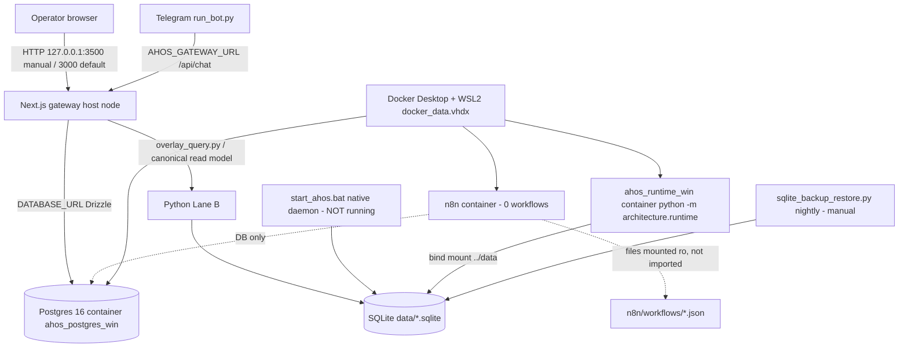

# DOCKER / n8n DEPENDENCY REALITY MAP — 2026-10-02 (Grok, read-only)

## 1. Compose / Docker files (tracked)
| File | Purpose |
|---|---|
| `deployment/docker-compose.windows.yml` | **Live project** (`com.docker.compose.project=deployment`, env file `G:\robat\ahos\.env`): `postgres` (ahos_postgres_win), `n8n` (ahos_n8n_win), `ahos-runtime` (ahos_runtime_win) |
| `deployment/docker-compose.yml`, `.production.yml`, `.target.yml` | other targets (not running) |
| `docker-compose.yml` (root) | not the running project (`docker compose ps` at root → empty) |
| `deployment/Dockerfile` | python:3.13-slim; `ENTRYPOINT /app/deployment/entrypoint.sh`; `CMD python3 -m architecture.runtime`; HEALTHCHECK 30s/5s → `deployment/healthcheck.py` |
| `docs/archive/consolidation_2026-09-26/n8n_legacy/docker-compose.yml` | archive only |

## 2. Services and why

| Service | Needed by | Why | Hard dependency? |
|---|---|---|---|
| PostgreSQL 16 (`ahos_postgres_win`, 127.0.0.1:5432) | Next.js gateway: `chat.ts:197-198` (chat history insert), `snapshot.ts` (engine state, paper, watch, cycles via Drizzle `@/db`), `engine.ts` | TS One-Brain read model + chat persistence; Drizzle owns `ahos_*` tables; also hosts n8n DB tables and legacy `trade_decisions`/`agent_audit_trail`/`agent_registry` | **Yes for the web gateway's full path**. Without it `/api/command` returns `failClosedCommandSnapshot` (`snapshot.ts:49-97`: running=false, CODE_FAILURE) — honest degradation; `/api/chat` 500s on insert |
| `ahos-runtime` container (127.0.0.1:18000→8000 live; compose says 8000) | nothing on the G2/chat path | runs `python3 -m architecture.runtime` against bind-mounted `../data` SQLite and `../reports` | **No** — duplicates the native path; Python Lane B evidence is SQLite under `data/` |
| n8n (`ahos_n8n_win`, 127.0.0.1:5678) | nothing in app code | automation edge; G12 only validates JSON structurally | **No** — 0 workflows imported in its DB |

Python Lane B (observation daemon, canonical decision, calibration, backups) runs on **SQLite files in `data/`** (`e01_discovery.sqlite`, `paper_trading.sqlite`, `ahos_local.sqlite`, `ahos_knowledge.sqlite`) — no Docker needed.

## 3. Native Windows path
- `start_ahos.bat` → `.venv` + `scripts/init_databases.py --with-guards` → `python -m architecture.runtime --daemon --interval-sec 60 --observation-cycle` with `AHOS_EVIDENCE_SOURCE=local`. **Exists; not currently running.**
- Next.js: `npm run dev` (host, not containerised).
- Only Docker-bound piece of the local user path = **Postgres for the web gateway**. A native Postgres for Windows (or an SQLite-backed Drizzle profile) would remove Docker from the operator path — DESIGN_ONLY, owner decision.
- RISK: the container and a native `start_ahos.bat` daemon would both write the same `data/*.sqlite` via the bind mount → dual-writer. Today only the container runs. Recommend one runtime owner (governance decision).

## 4. Config drift observed
- Running `ahos_runtime_win` created 2026-08-28 with healthcheck enabled + host port 18000; committed compose (`docker-compose.windows.yml:74-79`) disables the healthcheck and maps 8000 → unhealthy status is a stale-container artefact. Fix = recreate container = **service restart → OWNER_ACTION** (not done).
- Compose comment `docker-compose.windows.yml:74` and several scripts assume host Next on :3000 (see DASHBOARD_ONECLICK_REALITY).

## 5. n8n inventory
| Workflow file | Size | Notes |
|---|---|---|
| `n8n/workflows/ahos_01_data_ingest_integrity.json` | 7,165 B | ingest/integrity |
| `n8n/workflows/ahos_02_signal_pipeline.json` | 12,750 B | signal pipeline (strategy+risk gate mirror, see `engine/dryrun_simulation.py`) |
| `n8n/workflows/ahos_03_telegram_control.json` | 15,605 B | **unsafe** (SQL interpolation, audit DELETE, /approve bypasses canonical authority) — see TELEGRAM_REALITY_MAP §5 |
| `n8n/workflows/ahos_10_research_lab.json` | 3,731 B | research |
| `n8n/workflows/ahos_11_data_update.json` | 3,161 B | data update |
| `n8n/workflows/ahos_12_research_report.json` | 2,242 B | report |

Live n8n DB: `workflow_entity` count = **0** (read-only query, 2026-10-02 ~10:25Z). Workflows are mounted read-only at `/opt/workflows` but never imported.

App coupling (grep of *.py/*.ts/*.ps1/*.bat excluding archive): **no HTTP/webhook call from app code to n8n**. References are: G12 structural validator (`scripts/operator_validation_gate.py:566-580` → `tests/validate_n8n.py`), path helper `config/paths.py:99`, policy denials (`ahos_org/policy.py:52,74`, `research_worker/protocol.py:98,130` network_denied), health probes in Windows scripts, `architecture/control_plane.py:310` health-name list, `engine/bot_skeleton.py:4` comment.

Classification: n8n = **optional integration edge, not a runtime dependency**. Removing/stopping it would not affect G1–G10 (Claude's forensic mission reached the same conclusion; Grok confirms by code grep + empty workflow table).

Capabilities the n8n files describe that must be preserved if replaced: scheduled ingest + integrity check; signal pipeline gate (already mirrored in Python); Telegram status/health/agents replies (read-only); kill switch (should become an **independent Lane B control** not edge-coupled); human gate (must route through Canonical Decision Authority, never direct SQL); research report scheduling.

Candidate replacements: Python scheduler already in repo (`ahos_local.sqlite` has `scheduler_runs` 2,640 / `scheduler_heartbeats` / `scheduler_locks`; `docs/architecture/PRODUCTION_SCHEDULER_SPEC.md`), Windows Task Scheduler (owner-approved), internal orchestration via `architecture.runtime --daemon`.

## 6. Dependency graph

## 7. Summary
- Required for full local operator path: Docker → Postgres only (web gateway). Required for Python evidence/decision path: nothing in Docker.
- Optional: n8n (unused), runtime container (duplicate of native daemon, currently the only running observer).
- Next steps (DESIGN_ONLY): pick single runtime owner; native-Postgres or SQLite Drizzle option; quarantine AHOS-03; replace n8n schedules with the existing Python scheduler.
